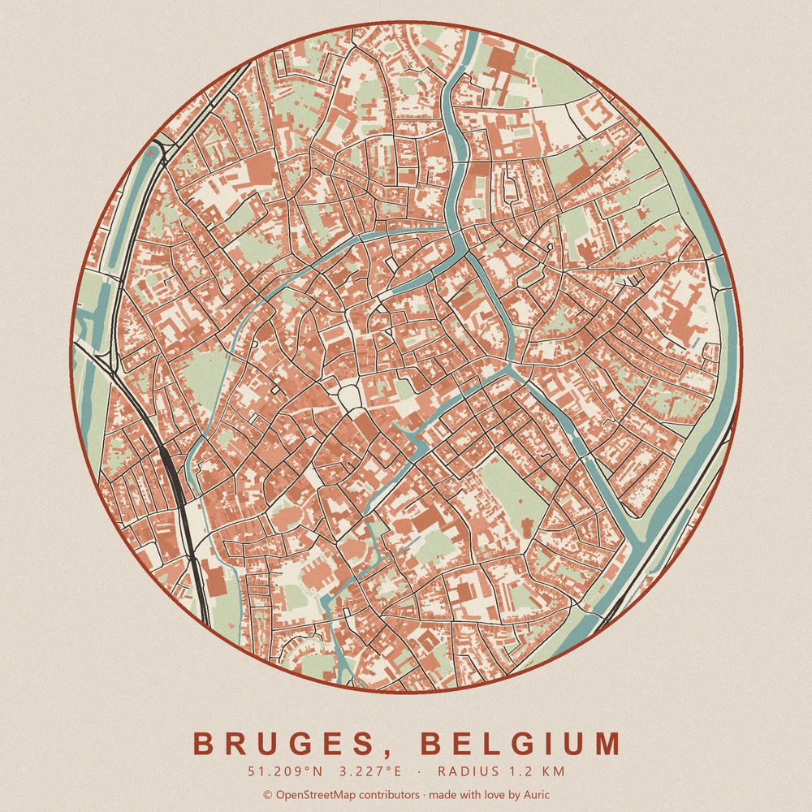
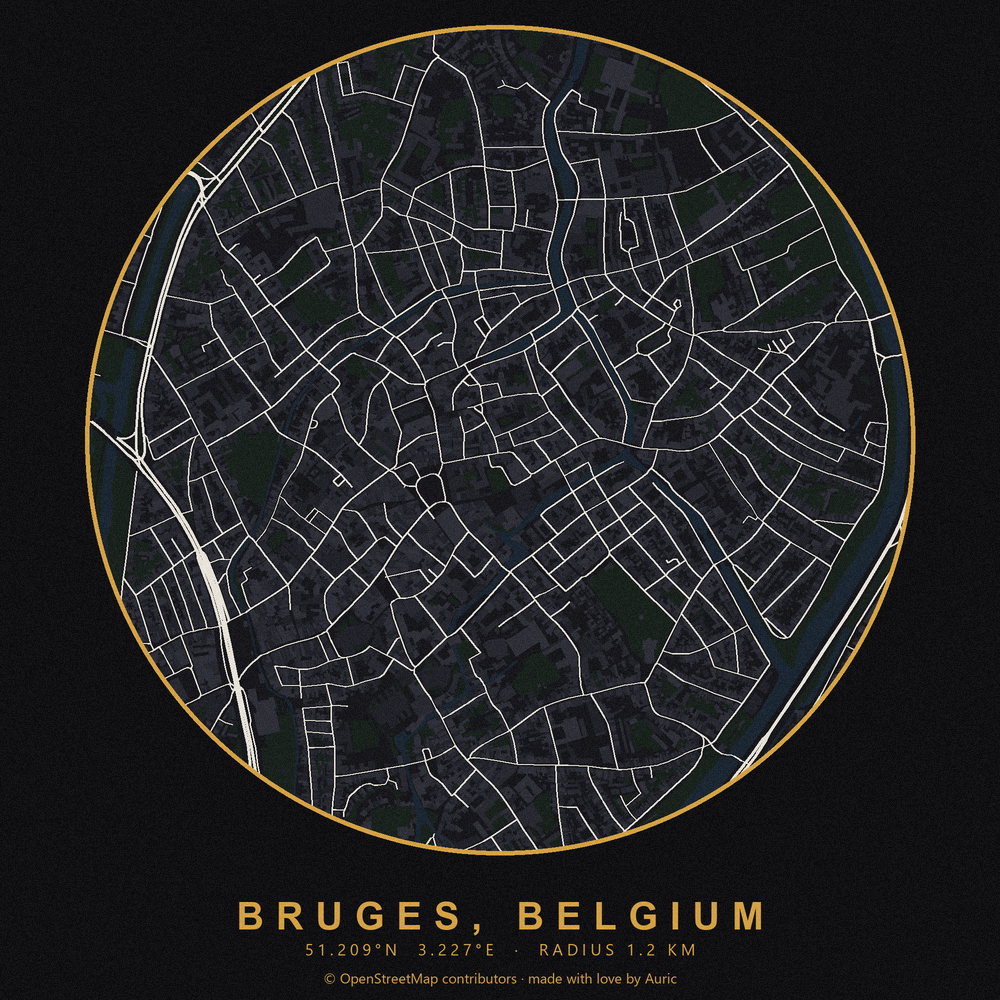
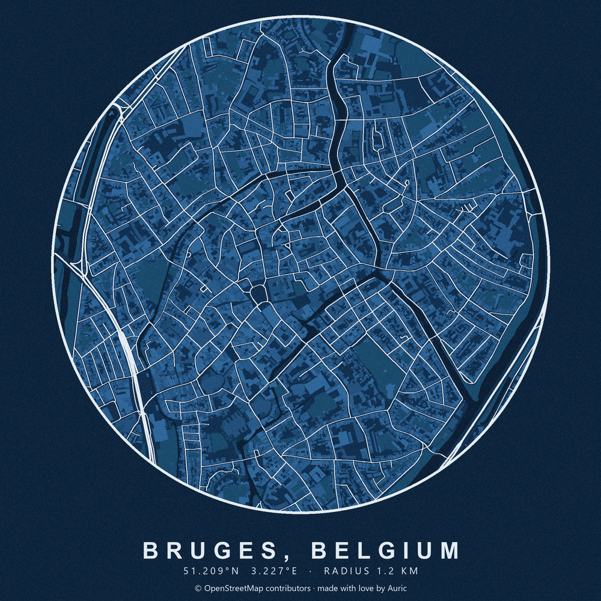
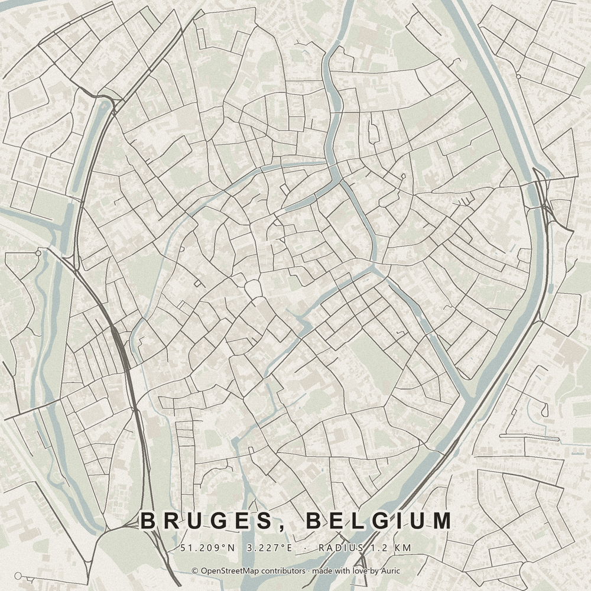

# mapcanvas

A little tool I built because I wanted posters of places I care about,
without paying poster-shop prices. You type in a city, pick how much of it
to show, choose a colour theme, and it draws the streets, rivers, parks and
buildings as flat shapes and hands you back a PNG. No tiles, no zoom
buttons, no GIS dashboard. Just a picture of a place.

Every poster is drawn live from OpenStreetMap, so it's the real street plan
of wherever you typed, not a stock image.

<p align="center">
  
</p>

## A few looks

Same city, different themes. There are six built in, and you can always
nudge the individual colours afterwards.

<p align="center">
  
  
  
</p>

## Running it

You'll need Python 3.12 or newer. Install the pinned dependencies, then
start the server:

```
py -m pip install -r requirements.txt
py app.py
```

(On macOS or Linux that's `python3` instead of `py`.)

Open http://127.0.0.1:5000 and you're in.

The first render of a new place takes a moment, because it has to download
the map data. After that the data is cached on disk, so playing with
colours and shapes is basically instant.

## Using it

1. Type a place, say `Lisbon, Portugal`, and set the radius around it.
2. Hit **Render poster**.
3. Try the themes: `gallery`, `noir`, `blueprint`, `sakura`, `cobalt`,
   `terracotta`.
4. Tweak single layers with the colour pickers, make roads thicker or
   thinner, switch between the round medallion and the square poster, and
   pick an output size.
5. **Download PNG** when you like what you see.

The **Random** button next to the place field drops in a random city, which
is a nice way to just look around.

If you don't care about the web page, the drawing part works on its own:

```python
import mapart

png = mapart.render("Lisbon, Portugal", 1500, mapart.PRESETS["noir"])
open("lisbon.png", "wb").write(png)
```

## How it works, roughly

`mapart.py` asks OpenStreetMap (through osmnx) for everything inside your
circle: roads, buildings, water, green areas. It projects that onto a flat
pixel canvas and paints the layers one over the other, water first, roads
last, with a title and coordinates at the bottom. To keep the edges clean it
draws at double size and scales down, so nothing comes out jagged. `app.py`
is a small Flask server around it, and the front end lives in
`templates/index.html`, `static/app.css` and `static/app.js`.

## What it won't do (yet)

Being honest about the rough edges, so nothing surprises you:

- **It needs the internet.** Every new place is fetched live from
  OpenStreetMap. There's no fully offline mode, apart from
  `python test_render.py`, which draws a fake city to check the code.
- **The first render is slow,** because it downloads the road network and
  features. Repeats of the same place are quick thanks to the disk cache.
  Restarting the server clears the in-memory style cache, though.
- **Overpass is a shared free service.** It rate-limits and sometimes times
  out. The tool retries once and then shows an error. Large radii in dense
  cities (toward the 10 km end) can be slow or fail outright.
- **Posters use your system's fonts.** On Windows that's Arial and Segoe UI.
  On another machine the lettering falls back to something else and looks a
  little different.
- **No street names or labels.** It's a shape poster, not a map you'd
  navigate with. The detail is only as good as OSM's coverage of the area.
- **Big exports cost more.** The 3000 px size renders at 6000 px internally
  before scaling down, so it uses noticeably more memory and time.
- **It's a local tool.** The Flask dev server is meant for your own machine,
  not for putting on the public internet.

## Checks

GitHub Actions runs the same offline checks on every pull request and every
push to `main`. You can run them locally without downloading any map data:

```
py -m compileall -q app.py mapart.py test_render.py test_web.py
node --check static/app.js
py -m unittest -v test_web
py test_render.py
```

## Collaborating

This is a personal project and I'm happy to share it. If you have ideas, run
into bugs, or want to add something, open an issue or a pull request, anyone
is welcome. Good places to start would be new themes, better lettering on the
poster, or more layers like railways and tram lines.

Next on my own list: turning this into a proper Python package, so
`pip install mapcanvas` just works and you can call `mapart.render` from
anywhere.

## One important thing

The map data belongs to the [OpenStreetMap
contributors](https://www.openstreetmap.org/copyright) (ODbL licence). Every
poster prints a small credit line for them at the bottom. Please leave it in
when you share your renders.

made with love by Auric
